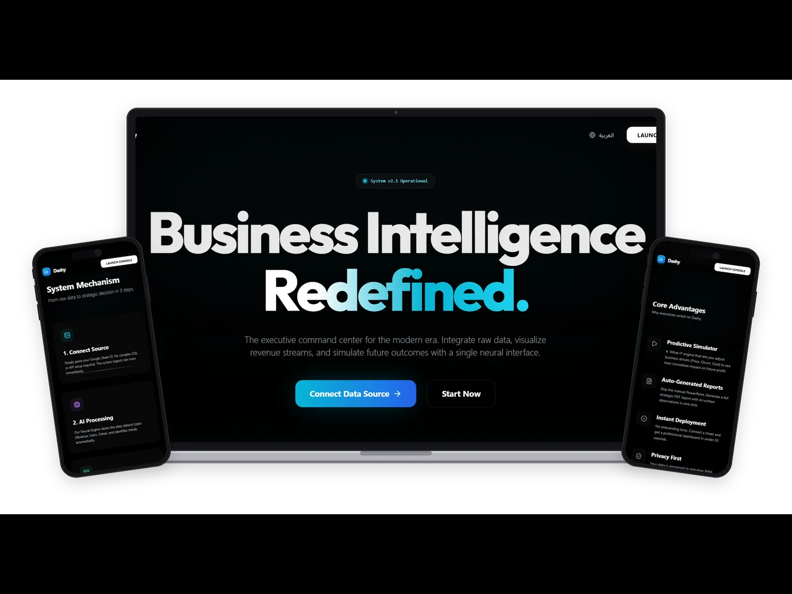

<div align="center">

# DashyAI — Analytics & Dashboard Automation

**An AI-powered analytics dashboard that turns a Google Sheet into live KPIs, smart charts, what-if forecasting, and an AI analyst you can talk to.**




</div>

## Overview

DashyAI connects to any Google Sheet through **n8n** workflows, detects the shape of the data automatically, and builds a dashboard around it — no manual chart configuration. An integrated AI analyst reads the same data to explain patterns, answer questions, and generate an executive report.

## Features

- **Live data sync** — Google Sheets → n8n webhook → dashboard, refreshed on demand.
- **Smart data engine** — detects dates, numeric metrics, and categorical dimensions (including Arabic numerals and currency formats) and builds KPIs from them.
- **Dynamic charts** — area, bar, line, composed, radar, radial, scatter, and pie, with multiple visual styles.
- **Auto-generated filters** — category, region, status, and more, derived from your columns.
- **What-if analysis** — adjust business drivers and forecast the impact on key metrics.
- **AI analyst chat** — ask questions about your data in natural language.
- **Strategic executive report** — one-click written summary of performance and recommendations.
- **Bilingual (EN / AR)** with full RTL layout and theme customisation.

## Tech Stack

| Layer | Technology |
| --- | --- |
| Frontend | React 19, TypeScript, Vite |
| Charts | Recharts |
| Automation | n8n workflows (webhooks) |
| Data source | Google Sheets |
| Icons | lucide-react |

## Getting Started

```bash
git clone https://github.com/Hashim0011/dashy-ai.git
cd dashy-ai
npm install
cp .env.example .env    # add your n8n webhook URLs
npm run dev             # http://localhost:3000
```

| Variable | Description |
| --- | --- |
| `VITE_N8N_DATA_WEBHOOK_URL` | n8n webhook that returns the sheet data |
| `VITE_N8N_CHAT_WEBHOOK_URL` | n8n webhook for the AI analyst chat |

Webhook URLs and the Sheet ID can also be changed at runtime from the in-app **Settings** panel.

## Project Structure

```
components/     # LandingPage, Charts, StatCard, FilterBar, WhatIfAnalysis, ChatInterface, SettingsPanel
services/       # n8nService — data fetching, analysis engine, report & chat requests
constants.ts    # Default settings, theme, EN/AR translations
types.ts        # Shared types
App.tsx         # App shell and views
```

## Author

**Hashim Al Masaabi** — [GitHub](https://github.com/Hashim0011) · [LinkedIn](https://www.linkedin.com/in/hashim-almasaabi-b51ba4353/)
